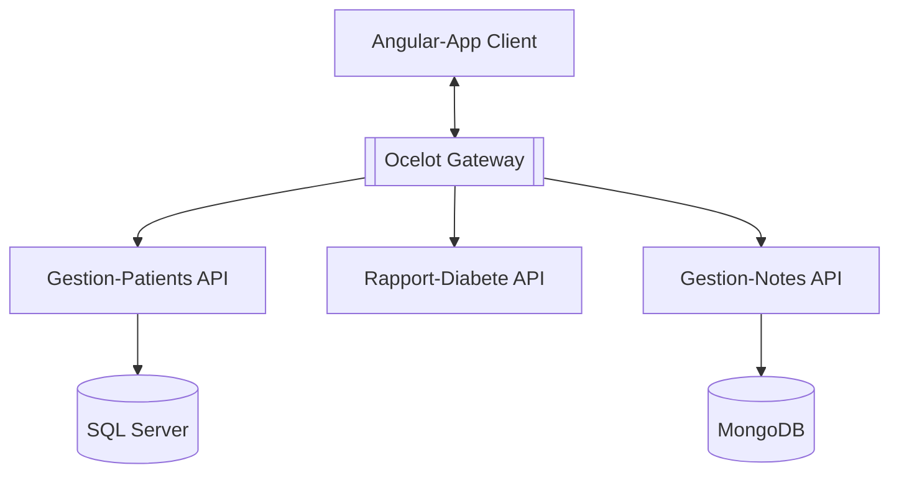

#  OP-P10-Microservices
> OpenClassrooms Projet 10 : Développez une solution en microservices pour votre client


## Informations Générales
Ce projet porte sur la gestion des patients par un organisateur, la prise de notes par un praticien et la détermination du risque de diabète chez un patient.

Sur le plan technique, l'objectif est de réaliser une application avec une architecture en microservices, d'utiliser une base de données noSQL pour les notes, et de s'intéresser au "Green Code".

Ce projet comporte 7 microservices :
 - Une api s'appelant Gestion-Patients
 - Une api s'appelant Gestion-Notes
 - Une api s'appelant Rapport-Diabete
 - Une gateway s'appelant Ocelot
 - Un base de données SQL Server
 - Une base de données MongoDB
 - Un application client angular

Ci-dessous vous pouvez retrouver un diagramme représentant l'architecture de l'application :



## Technologies utilisées
- Angular 17.2.1
- Angular Material
- RxJS
- .NET  8.0
- Docker
- Entity Framework Core
- JWT
- Swashbuckle
- Serilog
- Sql Server
- MongoDB

## Prérequis 
Pour faire fonctionner le projet, vous devez au préalable avoir installer sur votre machine :
- Git : https://git-scm.com/
- Docker : https://www.docker.com/

## Installation
Avant toute chose, vérifier que Docker est lancé sur votre ordinateur.

1. Cloner le projet 
	```
	git clone --single-branch --branch dev https://github.com/AxekPhanor/OP-P10-Microservices.git
	```
2. Dans le répertoire du projet utiliser cette commande pour créer nos images et lancer nos conteneurs docker. 
	```
	docker compose up
	```
	Cela peut prendre plus au moins de temps selon votre connexion internet et les performances de votre machine.

## Utilisation
Une fois que vous avez installer le projet, nos conteneurs devrait tourner sur différent port en local.
Pour accéder au l'application client : http://localhost:4277/
Vous devrez normalement voir apparaitre une page de connexion (si ce n'est pas le cas vous pouvez y accéder à cette adresse http://localhost:4277/login)

Lors de la création de nos conteneurs, 3 comptes ont été créés, chacun ayant différents accès ou restrictions sur l'application.

**Le compte organisateur:**
nom de compte : organizer
mot de passe : 6yb64nOav4M?JmHzn
Il possède le rôle organizer.

**Le compte praticien :**
nom de compte : practitioner
mot de passe : 6yb64nOav4M?JmHzn
Il possède le rôle practitioner.

**Le compte administrateur :**
nom de compte : admin
mot de passe : 6yb64nOav4M?JmHzn
Il possède les rôles organizer et practitioner.

Le rôle **organizer** vous permet de créer des patients, de modifier leurs informations personnelles, ou de les supprimer. Quant au rôle **practitioner**, vous pourrez accéder au dossier d'un patient, comprenant l'historique des notes, le risque de diabète du patient et vous aurez également la possibilité de créer des notes.

## Recommandations d'amélioration "Green"


## Etat du projet
Le projet est : _Terminé_ ✅

## Contact
Créer par [@AxekPhanor](https://github.com/AxekPhanor)

Mail : axel.phanor64@gmail.com
